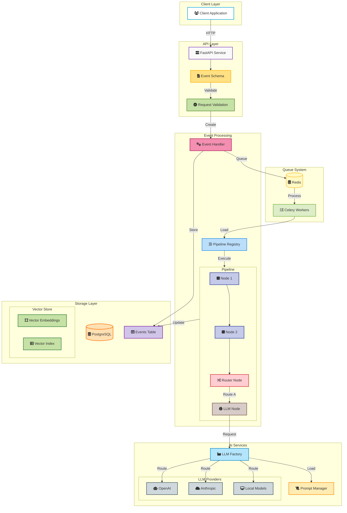
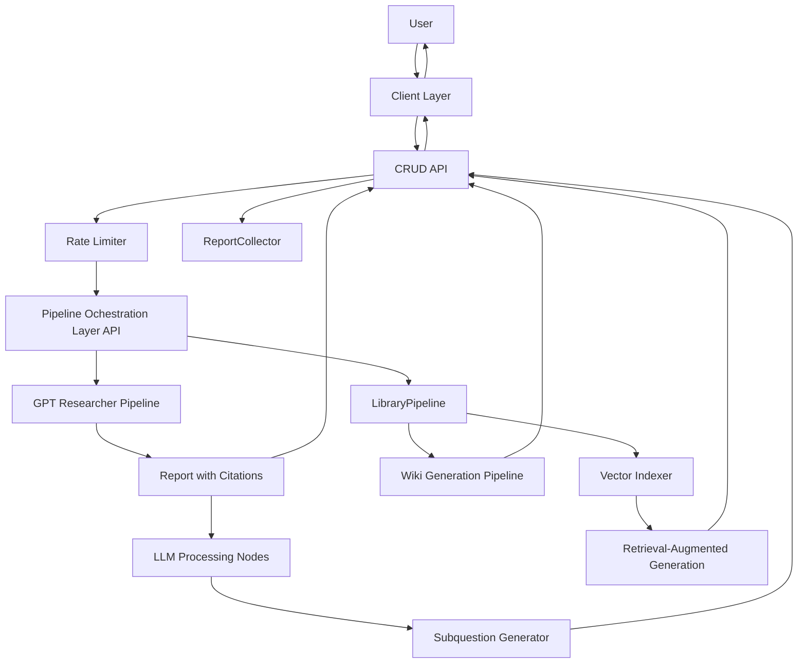

# High level breakdown
- A tool that utilises an existing gpt-researcher tool and enhances it with a looping workflow of n length, ultimately turning an individual query into a hyper linked wiki of research with citations for verification.
- The gpt-researcher takes a query, searches the web, and produces a report with citations.
- The new software will initiate gpt-researcher, and collect its results. It will use the report (via LLM), to generate a series of subquestions based on the initial query. Different types of subquestions can be asked for via a selection of prompts, chosen at the time of the initial query.
- These prompts will be designed to summarise, distill, reflect on, aggregate etc - a number of information functions useful in producing large bodies of interconnected knowledge. Which prompt is selected at which point remains to be determined; it could be algorithmic, AI agentic, or a combination of both.
- The generated subquestions are queued for processing. The gpt-researcher tool is actually called as part of an asynchronous event based pipeline, with each query sent as an event to an api. This is queued up by celery as a task and it is then responsible for passing each query into the pipeline.
- The pipeline initially passes off the query to gpt-researcher and awaits the report. On receipt, the report is sent back to the calling api, and it also passes the report down the pipeline to other nodes responsible for passing that report to LLMs with the information function prompts. It would even be possible at that point to use a series of nodes to execute in parallel, each with their own prompt, so that all prompts are handled all the time for maximum knowledge permutation.
- Every LLM response will have generated one or more further questions to ask. These are sent back to the calling api into a queue which will in turn send back as further events to the pipeline api. This will need to be rate limited to avoid exponentially larger requests of LLM compute time, but that rate can be set on a gradient to allow for the massive recruitment of parallel processing and report generation if required, for a set period of time, or perhaps token use / api cost depending how it is designed. Eventually, perhaps all three.
- As a seperately running process, the initiating api (that is recieving reports and subquestions), will be submitting collections of reports and their citations to the LLM pipeline, but under a different event type. This type will be responsible for initiating a seperate pipeline that takes reports and through one or more steps creates a series of interconnected markdown documents in the form of a wiki. Context length will need to be managed effectively here, but LLM endpoints with large context windows can also be used specifically for this purpose. The markdown documents are eventually sent back to the initiating api for collection under the initiating query, which serves as the 'root node', essentially. It may be possible to use graph structures for the linking of these documents, but I do not know much about this at all and for the sake of speed would probably need to abstract this away to a service, if one exists.
- A seperately running process, on completion of each root node (by time limit, request limit, cost limit etc), will send off the documents to be indexed by a vector database. The pipeline api has existing functionality to chunk and index documentation. I might use this, or I might delegate it to a specialist api, if doing it manually proves too time intensive, or two steep a learning curve. I want to ship an early version of this product as quickly as reasonably possible and get user feedback before going mad on features.
- This RAG database can then be queried by natural language for someone to be able to interact with the produced knowledge, as well as having the option to manually read the wiki. If I had to choose one version over the other for the MVP, I would choose RAG as I think this is probably more simple to implement and makes better use of the power of LLMs. At a minimum, the user should be able to manually read the documents produced by each root query and its children, though. This "human in the middle" aspect serves as another means by which further root queries can be generated to set off the workflow again, allowing a user to rapidly accumulate knowledge as their curiosity and own learning dictates, which is the USP of the product, potentially becoming a useful tool educational, clinical or research settings.




```
