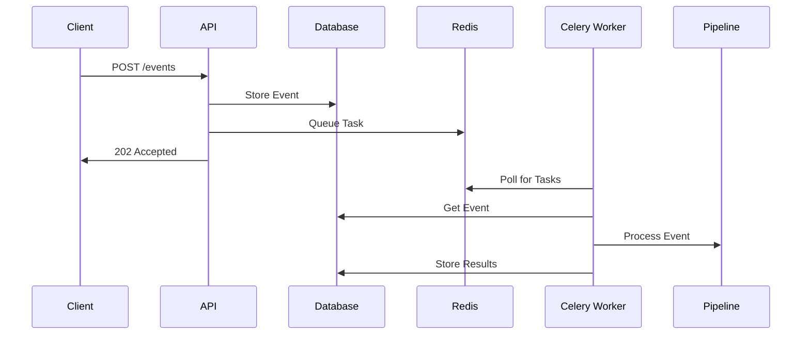

# Understanding the GenAI Launchpad Architecture

The GenAI Launchpad architecture represents a modern approach to building AI-powered applications, combining event-driven design principles with production-grade infrastructure. At its heart, it's designed to solve a common challenge in the AI development landscape: bridging the gap between experimental AI prototypes and production-ready systems.

## Introduction

Building AI applications often starts with exciting proof-of-concepts that demonstrate the potential of large language models like GPT-4 or Claude. However, turning these prototypes into robust, scalable applications requires significant infrastructure work – handling asynchronous processing, managing state, dealing with failures, and coordinating multiple services. This is where GenAI Launchpad comes in.

The architecture follows a clean separation of concerns, organizing the system into distinct layers that each serve a specific purpose. When a request arrives, it flows through these layers in a predictable pattern: from the API layer through event processing, queuing, and storage, with AI services seamlessly integrated throughout.

What makes this architecture particularly powerful is its foundation in battle-tested technologies. The system builds upon [FastAPI](https://fastapi.tiangolo.com/) for high-performance API handling, [PostgreSQL](https://www.postgresql.org/) with [pgvector](https://github.com/pgvector/pgvector) for robust data and vector storage, [Redis](https://redis.io/) and [Celery](https://docs.celeryq.dev/) for reliable task processing, and modern AI providers like OpenAI and Anthropic for language model capabilities.

## System Flow and Components

When a client application interacts with GenAI Launchpad, it initiates a carefully orchestrated flow through several architectural layers. Let's follow this journey to understand how each component contributes to the system's robustness.

### The Request Journey

Every interaction begins at the API layer, where FastAPI handles incoming HTTP requests. Rather than processing these requests synchronously, the system transforms them into events – a design choice that enables resilience and scalability. Each request is validated against predefined event schemas, ensuring data consistency before it enters the system's core.

The Event Handler serves as the system's traffic controller. It performs two critical tasks: persisting the event in PostgreSQL for audit and recovery purposes, and queuing it in Redis for asynchronous processing. This dual-write approach ensures that no request is lost, even if parts of the system experience temporary failures.

### Asynchronous Processing

The queuing system, built on Redis and Celery, forms the backbone of our asynchronous processing capabilities. Celery workers continuously monitor the queues, picking up events and routing them through appropriate processing pipelines. This architecture allows for horizontal scaling – simply add more workers when processing demands increase.

Each pipeline is composed of modular nodes that can be assembled like building blocks. A typical pipeline might include:

- Data transformation nodes
- Business logic nodes
- Router nodes for conditional processing
- LLM nodes for AI-powered operations

### AI Integration Layer

The AI services layer is particularly sophisticated, featuring a LLM Factory that abstracts away the complexities of working with different AI providers. The Prompt Manager maintains versioned prompts, ensuring consistent AI interactions across the system. Whether you're using OpenAI's GPT models, Anthropic's Claude, or local models, the interface remains consistent.

### Vector Storage and Retrieval

For applications requiring semantic search or similarity matching, the storage layer includes PostgreSQL with pgvector extension. This enables efficient storage and retrieval of high-dimensional vectors, essential for modern AI applications. The vector store is seamlessly integrated with the event processing pipeline, allowing for real-time updates to your vector index.

### Error Handling and Resilience

The system is designed with failure in mind. Each component includes robust error handling:

- Failed events are automatically retried with exponential backoff
- Dead letter queues capture problematic events for later analysis
- Database transactions ensure data consistency
- Circuit breakers prevent cascade failures when external services are unavailable

## Extensibility and Customization

While GenAI Launchpad provides a complete foundation, it's designed for extensibility. The Pipeline Registry allows you to register custom processing nodes, and the LLM Factory can be extended to support new AI providers. The event-driven architecture means you can add new capabilities without modifying existing code.

## Monitoring and Observability

The architecture includes comprehensive monitoring points throughout the pipeline. Every event is tracked from ingestion to completion, with timing and status information stored in PostgreSQL. This enables detailed analysis of system performance and helps identify bottlenecks or issues before they impact users.

## Deployment Considerations

The system is containerized using Docker, making it deployable in any environment that supports containers. The included Caddy server handles SSL/TLS termination and acts as a reverse proxy, simplifying deployment behind corporate firewalls or in cloud environments.