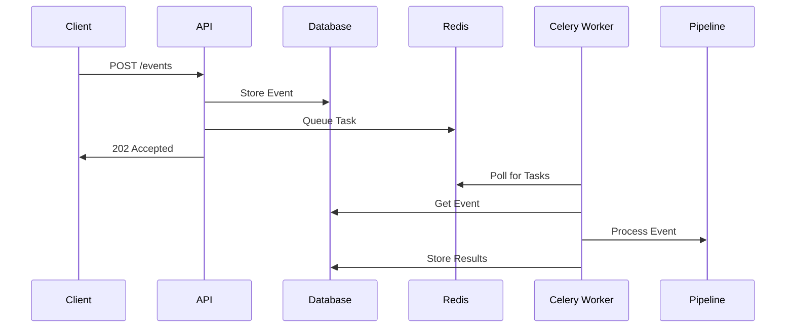

# Worker System

The GenAI Launchpad uses Celery for asynchronous task processing, implementing a robust event processing pipeline that separates API request handling from actual task execution.

## Architecture Overview

The worker system consists of three main components:

1. **API Endpoint**: Accepts and validates requests
2. **Redis Queue**: Manages task queue
3. **Celery Worker**: Processes tasks asynchronously



## Celery

Celery is an open-source, distributed task queue system that enables you to run time-consuming Python functions in the
background as asynchronous tasks. It allows your application to perform complex computations or handle heavy workloads
without blocking the main execution thread, thereby improving performance and user experience.

When combined with Redis, an in-memory data structure store used as a message broker, Celery can efficiently manage and
distribute tasks across multiple workers or machines.

### How Celery Works with Redis

1. Task Definition: You define tasks in your application using the @celery.task decorator. These tasks are regular
   Python functions that you want to run asynchronously.
2. Task Invocation: When your application needs to execute a task, it sends a message to the Celery task queue instead
   of executing the function immediately.
3. Message Broker (Redis): Redis acts as the intermediary that holds the task messages. It queues the tasks and ensures
   they are delivered to the workers.
4. Workers: Celery workers are processes that listen to the Redis queue. They pick up tasks, execute them, and can store
   the results if needed.
5. Result Backend (Optional): If you need to retrieve the results of a task, Celery can store them using Redis or
   another backend so your application can access them later.

### Benefits

- Asynchronous Execution: Offload long-running tasks to the background, keeping the main application responsive.
- Scalability: Easily add more workers to handle increased load without changing your application code.
- Reliability: Tasks are stored in Redis until they are successfully executed, ensuring no loss of tasks.
- Scheduling: Support for executing tasks at specific times or intervals.

## Task Flow Implementation

### 1. API Endpoint (endpoint.py)

The API endpoint implements a non-blocking pattern:

```python
@router.post("/")
def handle_event(
    data: EventSchema,
    session: Session = Depends(db_session),
) -> Response:
    # Store event in database
    repository = GenericRepository(session=session, model=Event)
    event = Event(data=data.model_dump(mode="json"))
    repository.create(obj=event)

    # Queue task for processing
    task_id = celery_app.send_task(
        "process_incoming_event",
        args=[str(event.id)],
    )

    return Response(
        status_code=HTTPStatus.ACCEPTED,
        content=json.dumps({
            "message": f"process_incoming_event started `{task_id}`"
        })
    )
```

This ensures:

- Immediate response to clients
- Persistent event storage
- Asynchronous processing
- Task tracking capability

### 2. Celery Configuration (celery_config.py)

Celery is configured to work with Redis as the message broker:

```python
def get_redis_url():
    redis_host = f"{os.getenv('PROJECT_NAME')}_redis"
    return f"redis://{redis_host}:6379/0"

@lru_cache
def get_celery_config():
    redis_url = get_redis_url()
    return {
        "broker_url": redis_url,
        "result_backend": redis_url,
        "task_serializer": "json",
        "accept_content": ["json"],
        "result_serializer": "json",
        "enable_utc": True,
        "broker_connection_retry_on_startup": True,
    }

celery_app = Celery("tasks")
celery_app.config_from_object(get_celery_config())
```

Key features:

- Redis as both broker and result backend
- JSON serialization for tasks and results
- Automatic task discovery
- Connection retry on startup

### 3. Task Processing (tasks.py)

The worker processes tasks through a well-defined lifecycle:

```python
@celery_app.task(name="process_incoming_event")
def process_incoming_event(event_id: str):
    with contextmanager(db_session)() as session:
        # Get event from database
        repository = GenericRepository(session=session, model=Event)
        db_event = repository.get(id=event_id)
        
        # Convert to schema and process
        event = EventSchema(**db_event.data)
        pipeline = PipelineRegistry.get_pipeline(event)
        
        # Execute pipeline and store results
        task_context = pipeline.run(event).model_dump(mode="json")
        db_event.task_context = task_context
        repository.update(obj=db_event)
```

This implementation:

- Retrieves event data from database
- Determines appropriate pipeline
- Executes processing pipeline
- Stores results back to database